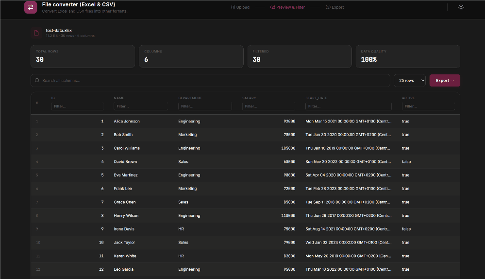
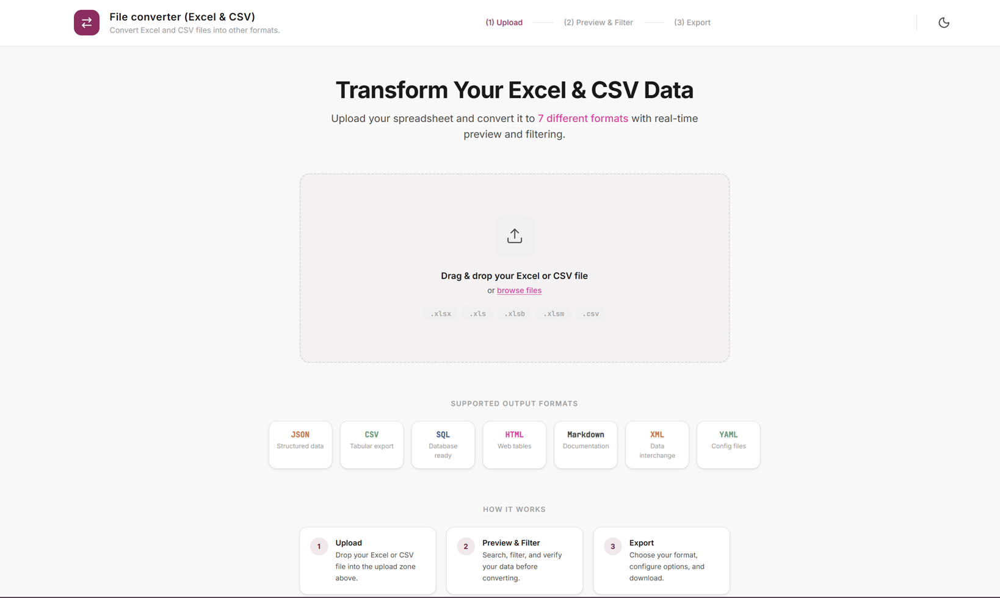
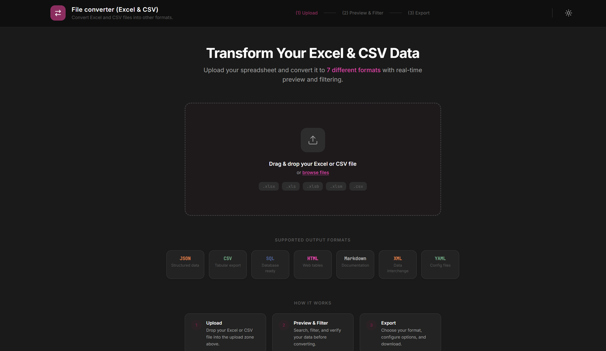
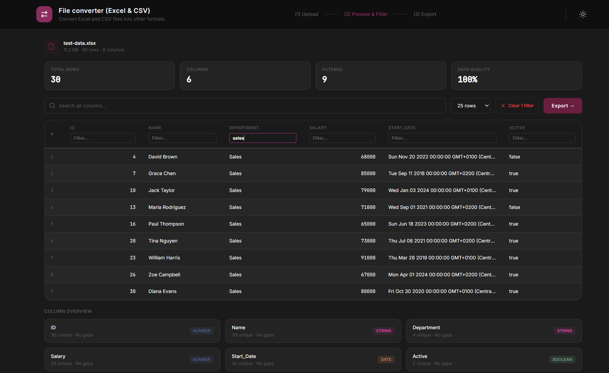
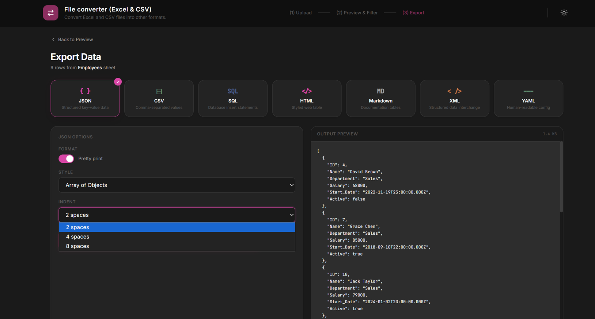

# Excel-to-All



Excel-to-All is an agile utility designed to streamline data migration and transformation. It solves the operational problem of extracting and manipulating data from spreadsheets (`.xlsx`, `.csv`), allowing you to filter data in real-time and export it instantly to multiple structured formats.

<p align="center">
  
  
</p>
<p align="center">
  
  
</p>

## ✨ Key Features
- **Multi-format Import**: Seamlessly load both `.xlsx` and `.csv` files.
- **Real-time Filtering**: Refine and filter your data rows before exporting to ensure you only get the exact dataset you need.
- **Advanced Export Options**: Each export format comes with tailored configuration tools. For instance, you can adjust indentation styles for JSON, or configure headers and custom separators for CSV exports.


## 🚀 Getting Started (Local Installation)

If you want to run or modify this project locally, follow these simple steps. We use **[pnpm](https://pnpm.io/)** for managing dependencies as it is faster and more efficient.

1. **Clone the repository**:
   ```bash
   git clone https://github.com/FluxFae/Excel-to-All.git
   cd Excel-to-All
   ```

2. **Install dependencies**:
   Make sure you have `pnpm` installed. Then run:
   ```bash
   pnpm install
   ```

3. **Start the development server**:
   ```bash
   pnpm run dev
   ```
   This will start the local server. Open the link provided in your terminal (usually `http://localhost:5173`) to view the application in your browser.


## ⚙️ Tech Stack
- **Frontend**: React 19, TypeScript, Vite, Tailwind CSS v4. (Includes integration with `ui-core-components`).
- **Data Processing**: SheetJS (xlsx) and JS-YAML for data handling and conversion directly on the client side.

*(No backend applies, this is a 100% local/client-side tool)*.

## 🤖 Development & Vibecoding
This project was orchestrated using vibecoding methodologies with AI agents. The development workflow prioritizes rapid problem resolution and iterative AI collaboration over manual implementation.

## 🚧 Project Status (As-Is) & Contributions
This is a personal use tool open-sourced for the community. It currently does not have active maintenance or a planned development roadmap.

If you find this tool useful, discover a bug, or want to add an improvement, Pull Requests are welcome. I will review and integrate community contributions based on availability.

## 📜 License
Distributed under the MIT License.